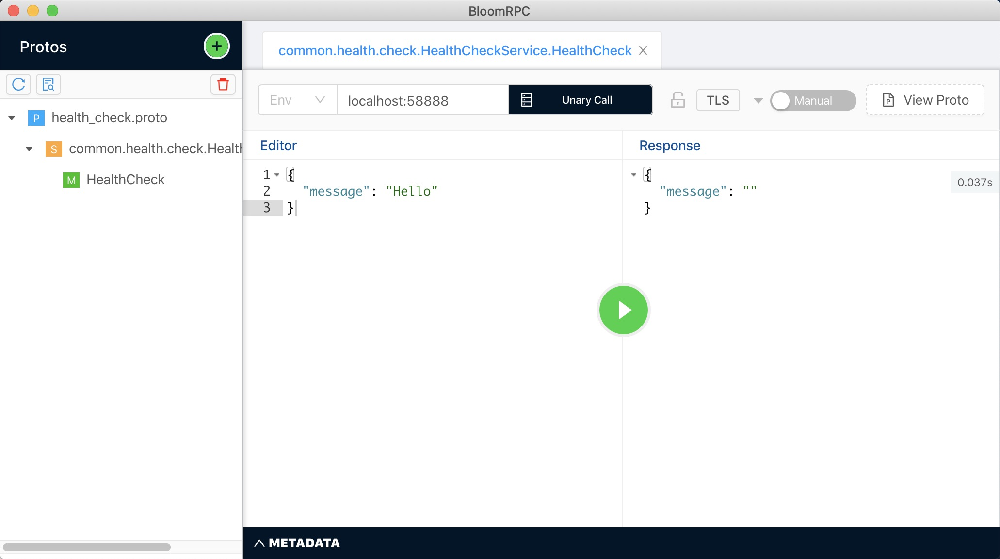

# DarkMetrix Gofra

>  Don't reinvent the wheel, just realign it.

It's famous in IT industry and I'm quiet a believer of that. 

Gofra is a framework and tool set helps to easily generate gRPC service in Go.

All the tools and libraries are open sourced, you could use it out of box.


## Installation

First [Google's Protocol Buffers](https://developers.google.com/protocol-buffers/) Version 3 is required to be installed.

Second [golang/protobuf](https://github.com/golang/protobuf) is also needed to be installed to generate gRPC service from *.proto file.

Then install Gofra

```bash
$ go get -u github.com/DarkMetrix/gofra/gofra
```


## Guide

- [Creating a Service Template](#creating-a-service-template)

### Creating a Service Template

**Now gofra used go module, so you need to update your Go version up to at least v1.11**

`Notice: 'gofra' should be running under the same directory with template.json, except 'gofra template init' command `

First initialize default template file as below.

```bash
$ gofra templates init
```

You need to type Author Name, Project Name, Project Address & Server Type.

 A **template.json** file will be generated in the current directory which looks like this.

```json
{
    "author":"foo",
    "project":"test_gofra",
    "version":"v1",
    "type":"grpc",
    "server":
    {
        "addr":"localhost:58888"
    },
    "monitor_package":
    {
        "package":"github.com/DarkMetrix/gofra/pkg/grpc-utils/monitor/statsd",
        "init_param":"\"127.0.0.1:8125\", \"test_gofra\""
    },
    "tracing_package":
    {
        "package":"github.com/DarkMetrix/gofra/pkg/grpc-utils/tracing/jaeger",
        "init_param":"\"127.0.0.1:6831\", \"test_gofra\""
    },
    "interceptor_package":
    {
        "monitor_package":"github.com/DarkMetrix/gofra/pkg/grpc-utils/interceptor/statsd_interceptor",
        "tracing_package":"github.com/DarkMetrix/gofra/pkg/grpc-utils/interceptor/opentracing_interceptor"
    }
}

```

| Json object                         | Value                                                        | Remark       |
| ----------------------------------- | ------------------------------------------------------------ | ------------ |
| author                              | Author's name                                                | User defined |
| project                             | Project's name                                               | User defined |
| version                             | Version                                                      | User defined |
| type                                | Type                                                         | grpc or http |
| server.addr                         | Service's ip and port                                        | User defined |
| monitor_package.package             | Monitor package import path used in the service(by default **statsd** is used as the monitor backend), you could write your own monitor package as long as you implement Init & Increment interfaces | Pre defined  |
| monitor_package.init_param          | Monitor params used by Init method(it's the statsd address and project name used in your environment) | Pre defined  |
| Tracing_package.package             | Tracing package import path used in the service(by default **jaeger** is used as the monitor backend), you could write your own tracing package as long as you implement Init interface | Pre defined  |
| Tracing_package.init_param          | Tracing params used by Init method(it's the jaeger address and project name used in your environment) | Pre defined  |
| Interceptor_package.monitor_package | Monitor gRPC interceptor(by default **statsd** is used as the monitor backend) | Pre defined  |
| Interceptor_package.tracing_package | Tracing gPRC interceptor(by default **jaeger** is used as the tracing system) | Pre defined  |


## gRPC
- [gRPC Service Generation](#grpc-service-generation)
- [Add or Update Services](#add-or-update-services)
- [Implement RPC Methods](#implement-rpc-methods)
- [Compile and Run](#compile-and-run)
- [Test using BloomRPC](#test-using-bloomrpc)

### gRPC Service Generation

```bash
$ gofra init --path=./templates.json
```

All files needed are generated.

```bash
$tree
|-- api
|   `-- protobuf_spec
|       |-- health_check
|           |-- health_check.pb.go
|           `-- health_check.proto
|-- build
|-- cmd
|   `-- main.go
|-- configs
|   |-- config.toml
|   `-- log.config
|-- go.mod
|-- internal
|   |-- app
|   |   `-- application.go
|   |-- grpc_handler
|   |   |-- HealthCheckService
|   |       |-- HealthCheck.go
|   |       `-- HealthCheckService.go
|   `-- pkg
|       |-- common
|       |   `-- common.go
|       `-- config
|           `-- config.go
|-- log
`-- templates.json
```


### Add or Update Services

By default a health check service is generated.

And you could add your own service, e.g.:

#### Write user.proto

``` protobuf
syntax = "proto3";

package user;

// The user service definition.
service UserService {
  rpc AddUser (AddUserRequest) returns (AddUserResponse) {}
}

message AddUserRequest {
    string name = 1;
}

message AddUserResponse {
    string name = 1;
}
```

#### Add Service

```bash
$ gofra service add --path=./user.proto
```

Then a directory **UserService** & two files **AddUser.go** and **UserService.go** are generated.

And generated **user.proto** and **user.pb.go** file will be copied to **api/protobuf_spec/user** directory.

```bash
$ tree

.
|-- api
|   `-- protobuf_spec
|       |-- health_check
|       |   |-- health_check.pb.go
|       |   `-- health_check.proto
|       `-- user
|           |-- user.pb.go
|           `-- user.proto
|-- build
|-- cmd
|   `-- main.go
|-- configs
|   |-- config.toml
|   `-- log.config
|-- go.mod
|-- internal
|   |-- app
|   |   `-- application.go
|   |-- grpc_handler
|   |   |-- HealthCheckService
|   |   |   |-- HealthCheck.go
|   |   |   `-- HealthCheckService.go
|   |   `-- UserService
|   |       |-- AddUser.go
|   |       `-- UserService.go
|   `-- pkg
|       |-- common
|       |   `-- common.go
|       `-- config
|           `-- config.go
|-- log
`-- templates.json
```

#### Update Service

You could update the service if the pb file has been updated, such as adding a new RPC to the UserService.

The only difference between add and update is update won't override the file already exist.

Using **add** command, a **--override=true** flag will help to override all the files generated about the pb file.


### Implement RPC Methods

After add or update service, all the thing left is to implement your own business logic.

All basic logging, metrics, tracing, panic recovery have been already integrated by gRPC interceptor.


#### UserService/UserService.go

You do not need to do anything about this file, just leave it.

```go
/**********************************
 * Author : foo
 * Time : 2018-03-26 23:04:23
 **********************************/

package UserService

// Implement UserService interface
type UserServiceImpl struct{}
```


#### UserService/AddUser.go

Implement your own business logic.

```go
/**********************************
 * Author : foo
 * Time : 2018-04-01 02:26:20
 **********************************/

package UserService

import (
        "context"

        // log package
        // log "github.com/cihub/seelog"
    
        // monitor package
        // monitor "github.com/DarkMetrix/gofra/pkg/grpc-utils/monitor/statsd"
    
        // tracing package
        // opentracing "github.com/opentracing/opentracing-go"
    
        pb "github.com/DarkMetrix/gofra/tmp/demo/src/proto/user"
)

func (this UserServiceImpl) AddUser (ctx context.Context, req *pb.AddUserRequest) (*pb.AddUserResponse, error) {
       // log.Infof("====== AddUser start ======")

        resp := new(pb.AddUserResponse)
    
        return resp, nil
}
```


### Compile and Run

#### Complie

```bash
$ cd cmd
$ go build -o ../build/test_gofra
```


#### Run

```bash
$ cd ../build
$ ./test_gofra

====== Server [test_gofra] Start ======
Listen on port [:58888]
```


### Test using BloomRPC

#### Send request via BloomRPC




#### Service output

```bash
[DEBUG][2020-03-11T23:17:44.096220][test_gofra][seelog_interceptor.go:53][GofraServerInterceptorFunc] => handle success! req=message:"Hello" , reply:
```

## Docker

### Dockerfile Generation

```bash
$ gofra docker generate
```

A Dockerfile is generated within the same directory as template.json.

```dockerfile
FROM centos:latest
MAINTAINER foo

COPY ./build /app/test_gofra/bin/
COPY ./configs /app/test_gofra/configs/

WORKDIR /app/test_gofra/bin

ENTRYPOINT ["./test_gofra"]
```

## Kubernetes

### Deployment YAML Generation

```bash
$ gofra kube deployment
```

You need to type the image name used.

Then A simple **./kubernetes/deployment.yml** is generated.

```yaml
# API version
apiVersion: apps/v1

# resource type
kind: Deployment

# metadata of the deployment
metadata:
  name: test_gofra
  labels:
    app: test_gofra
    version: v1

# specification
spec:
  # replica number to run
  replicas: 1

  selector:
    matchLabels:
      app: test_gofra
      version: v1

  # using this templates to create pod
  template:
    metadata:
      labels:
        app: test_gofra
        version: v1

    spec:
      containers:
        - name: test_gofra
          image: test_gofra:v1
          ports:
            - containerPort: 58888
      restartPolicy: Always

  ##########################################
  # More features and details, please visit
  #     'https://kubernetes.io/docs/reference/generated/kubernetes-api/v1.17/'
  # to get more information, this URL is for kubernetes v1.17 only
  ##########################################
```


### Service YAML Generation

```bash
$ gofra kube service
```

A simple **./kubernetes/service.yml** is generated.

```yaml
# API version
apiVersion: v1

# resource type
kind: Service

# metadata of the service
metadata:
  name: test_gofra

# specification
spec:
  type: ClusterIP

  ports:
    - name: http
      port: 58888
      protocol: TCP
      targetPort: 58888

  selector:
    app: test_gofra

  ##########################################
  # More features and details, please visit
  #     'https://kubernetes.io/docs/reference/generated/kubernetes-api/v1.17/'
  # to get more information, this URL is for kubernetes v1.17 only
  ##########################################
```

### Configmap Shell Script Generation

```bash
$ gofra kube configmap
```

Then a **./kubernetes/configmap.sh** file is generated.

```bash
#!/bin/bash

case $1 in

"create")
  echo "configmap 'configmap-test' creating..."
  kubectl create configmap configmap-test --namespace='' --from-file=../configs
  ;;

"update")
  echo "configmap 'configmap-test' deleting..."
  kubectl delete configmap configmap-test --namespace=''

  echo "configmap 'configmap-test' creating..."
  kubectl create configmap configmap-test --namespace='' --from-file=../configs
  ;;

"delete")
  echo "configmap 'configmap-test' deleting..."
  kubectl delete configmap configmap-test --namespace=''
  ;;

"get")
  echo "configmap 'configmap-test' getting..."
  kubectl describe configmap configmap-test --namespace=''
  ;;

"")
  echo "no command found! command list [create, update, delete, get]"
  ;;

esac
```


## Istio

### Virtual Service YAML Generation

```bash
$ gofra istio virtual-service
```

A simple **./istio/virtual-service.yml** is generated.

```yaml
apiVersion: networking.istio.io/v1alpha3
kind: VirtualService
metadata:
  name: test_gofra

spec:
  hosts:
    - test_gofra            # hosts will be interpreted as ${hosts}.${k8s-namespace}.svc.cluster.local in k8s environment
  http:
    - route:
      # destination works with host and subset defined in destination rule
      # if using destination rule to manage traffic policy, then you could use subset to manage route rule
      - destination:
          host: test_gofra # host will be interpreted as ${hosts}.${k8s-namespace}.svc.cluster.local in k8s environment
          subset: v1

      timeout: 2s

      # destination works with host and port
      #- destination:
      #    host: test_gofra  # host will be interpreted as ${hosts}.${k8s-namespace}.svc.cluster.local in k8s environment
      #	  port:
      #	    number: 58888 # port defined in kubernetes service

      # retry setting, use it as business needs
      #retries:
      #  attempts: 2
      #  perTryTimeout: 2s

      # There's a lot of features, such as traffic mirroring, weighted routing etc.

  ##########################################
  # More features and details, such as:
  #     CORS Policy
  #     HTTP Fault Injection
  #     HTTP Match, Redirect, Retry, Rewrite, Route, Headers
  #     TPC Route
  #     Route Destination
  #     TLS setting
  #     ...
  # Please visit
  #     'https://istio.io/docs/reference/config/networking/virtual-service/'
  # to get more information
  ##########################################
```


### Destination Rule YAML Generation

```bash
$ gofra istio destination-rule
```

A simple **./istio/destination-rule.yml** is generated.

```yaml
apiVersion: networking.istio.io/v1alpha3
kind: DestinationRule
metadata:
  name: test_gofra
spec:
  host: test_gofra # host will be interpreted as ${hosts}.${k8s-namespace}.svc.cluster.local in k8s environment

  # traffic policy setting
  trafficPolicy:
    loadBalancer:
      simple: ROUND_ROBIN

  # subsets definition
  subsets:
    - name: v1        # subset name, it could be used in virtual service to define routing rule
      labels:
        version: v1   # all traffic from subset v1 will be routed to application with v1 label

  ##########################################
  # More features and details, such as:
  #     Connection Pool
  #     Load Balancer
  #     Outliner Detection
  #     TLS setting
  #     ...
  # Please visit
  #     'https://istio.io/docs/reference/config/networking/destination-rule/'
  # to get more information
  ##########################################
```


## License

### Gofra

[MIT license](https://github.com/DarkMetrix/gofra/blob/master/LICENSE)

### Dependencies
- google.golang.org/grpc [Apache 2.0 License](https://github.com/grpc/grpc-go/blob/master/LICENSE)
- github.com/cihub/seelog [BSD License](https://github.com/cihub/seelog/blob/master/LICENSE.txt)
- github.com/spf13/viper [MIT License](https://github.com/spf13/viper/blob/master/LICENSE)
- github.com/spf13/cobra [Apache 2.0 License](https://github.com/spf13/cobra/blob/master/LICENSE.txt)
- github.com/go-ozzo/ozzo-validation [MIT License](https://github.com/go-ozzo/ozzo-validation/blob/master/LICENSE)
- github.com/mitchellh/go-homedir" [MIT License](https://github.com/mitchellh/go-homedir/blob/master/LICENSE)
- github.com/grpc-ecosystem/go-grpc-middleware [Apache 2.0 License](https://github.com/grpc-ecosystem/go-grpc-middleware/blob/master/LICENSE)
- github.com/tallstoat/pbparser [MIT License](https://github.com/tallstoat/pbparser/blob/master/LICENSE)
- github.com/alexcesaro/statsd [MIT License](https://github.com/alexcesaro/statsd/blob/master/LICENSE)
- github.com/silenceper/pool [MIT License](https://github.com/silenceper/pool/blob/master/LICENSE)
- github.com/opentracing/opentracing-go [MIT License](https://github.com/opentracing/opentracing-go/blob/master/LICENSE)
- github.com/openzipkin/zipkin-go-opentracing [MIT License](https://github.com/openzipkin/zipkin-go-opentracing/blob/master/LICENSE)
- github.com/jaegertracing/jaeger-client-go [Apache 2.0 License](https://github.com/jaegertracing/jaeger-client-go/blob/master/LICENSE)

### Tools used

[BloomRPC](https://github.com/uw-labs/bloomrpc)
[Postman](https://www.postman.com/)


